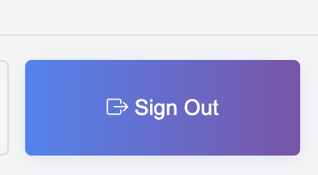

# Chatroom Project

**Web Link**: [https://chatroom-7b293.web.app](https://chatroom-7b293.web.app)  
**GitHub Repository**: [https://github.com/JustinShih0918/chatroom.git](https://github.com/JustinShih0918/chatroom.git)

## Basic Operations

1. Upon entering the website, you will see a gradient background with a **Sign In / Sign Up** button.
2. Click the button to access the authentication interface.  
   When you move your mouse across the background, you will see a glowing effect where the cursor is.

   

3. You can either:
   - Use **Google Sign In**, or  
   - Select **Sign Up**, then enter your email and password to register an account.

4. After logging in, a loading animation will appear.

   

5. Once inside the chatroom, click **New Chatroom** in the top left corner, enter a chatroom name, and create a new chatroom.

   

6. After creating a chatroom, it will appear at the bottom of the chatroom list on the left.

   

7. Click on a chatroom to enter it.  
   Then, click the **Settings** icon at the top right to add friends to the chatroom.
   - Enter a username (for example, searching for `Justin` will find my account).
   - Click the user to add them.

     
   

8. Once members are added (visible in the **Member list**), you can start chatting!  
   Type your message and press **Enter** or click the **Send** button.

   

9. If you receive a message in a chatroom you are not currently viewing, you will get a notification.

   

10. To switch accounts, click **Sign out** at the bottom left.

   

## Bonus Features

### Profile Page

- Click **Edit Profile** in the bottom left.

  

- Select a different avatar.

  

- After updating your profile, click **Save Profile**.

  

- Once saved, click **Back to Chatroom**.

  

- Your avatar will now be successfully updated.

  

### Unsend Message

- Right-click on a message you want to delete; a context menu will appear.

  

- Select **Unsend** to delete the message.  
  If you do not want to delete, click **Close** to cancel.

### Search Message

- Click the **Settings** icon in the top right of the chatroom to open the settings panel.
- Enter a keyword in the **Search Message** field and click **Search**.

  

- Click the found message to jump directly to it.

  

- All matched keywords will be highlighted until you clear the search box in the settings panel.

### Send GIFs

- Click the **GIF** button at the bottom right.

  

- Enter a keyword and click **Search**.

  

- Select the GIF you want to send.  
  If you don’t want to send any GIF, click **Close** to exit the search window.

## How to Set Up the Project Locally

1. Unzip the `Midterm_Project_112062109.zip` file.
2. Open a terminal and navigate to the project folder:

   ```bash
   cd ../Midterm_Project_112062109
   ```
   ```bash
    npm install
   ```
   ```bash
    npm start
   ```
> **Note:**  
> If you change your avatar on the local version, it will cause the web version avatar to disappear due to different image path sources.

