# Chatroom

Realtime chat web application with account authentication, multi-room conversations, profile customization, message search, GIF sharing, and unread-message notifications. The deployed app is available at [https://chatroom-7b293.web.app](https://chatroom-7b293.web.app).

## Resume Summary

Built and deployed a React/Firebase chat application that supports authenticated users, chatroom creation, member management, realtime messaging, profile editing, notifications, message deletion, keyword search, and GIF sending. The project demonstrates frontend state management, Firebase integration, realtime UX design, and production deployment.

## Key Features

- **Authentication**: email/password sign-up and Google sign-in.
- **Chatroom management**: create chatrooms and add members by username.
- **Realtime messaging**: send and receive messages inside shared rooms.
- **Unread notifications**: alert users when new messages arrive in rooms they are not currently viewing.
- **Profile editing**: update display avatar from the profile page.
- **Message controls**: right-click context menu for unsending messages.
- **Search**: find messages by keyword and jump directly to matched content.
- **GIF support**: search and send GIFs from the chat UI.
- **Deployed demo**: Firebase-hosted web app with screenshots in this README.

## Tech Stack

| Area | Tools |
| --- | --- |
| Frontend | React 18, React Router |
| Backend / Services | Firebase Authentication, Firebase-hosted data services |
| Networking | Axios |
| Styling / UI | CSS, Bootstrap Icons |
| Tooling | Create React App, npm |
| Deployment | Firebase Hosting |

## Demo

**Web Link**: [https://chatroom-7b293.web.app](https://chatroom-7b293.web.app)  
**Repository**: [https://github.com/JustinShih0918/chatroom](https://github.com/JustinShih0918/chatroom)

## Product Walkthrough

### 1. Sign In / Sign Up

Users enter through an animated landing page and can authenticate with Google or email/password.


### 2. Loading State

After login, the app displays a loading transition before entering the chat experience.

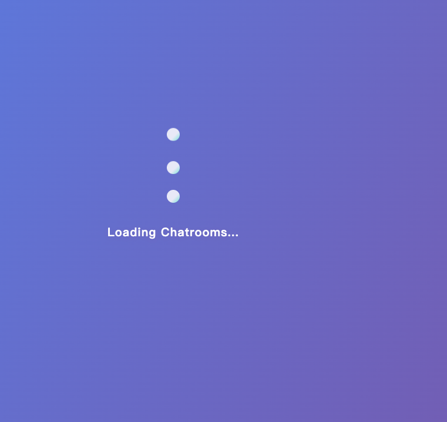

### 3. Create and Join Chatrooms

Users can create a chatroom, select it from the room list, and manage membership through the settings panel.

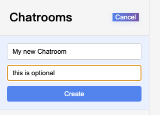
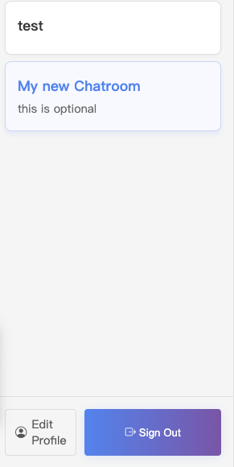

### 4. Add Members

Room owners can search for users by username and add them to the current room.

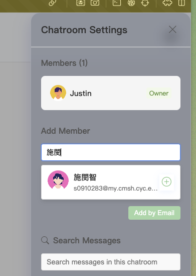
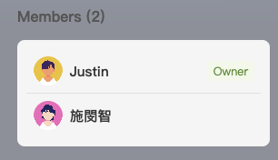

### 5. Chat and Notifications

Users can send messages, switch rooms, and receive notifications for activity outside the active room.

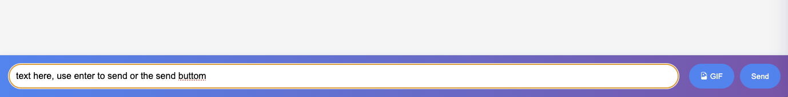
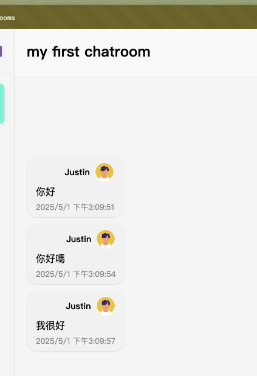

## Bonus Features

### Profile Page

Users can edit their profile and choose a new avatar.

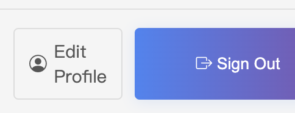
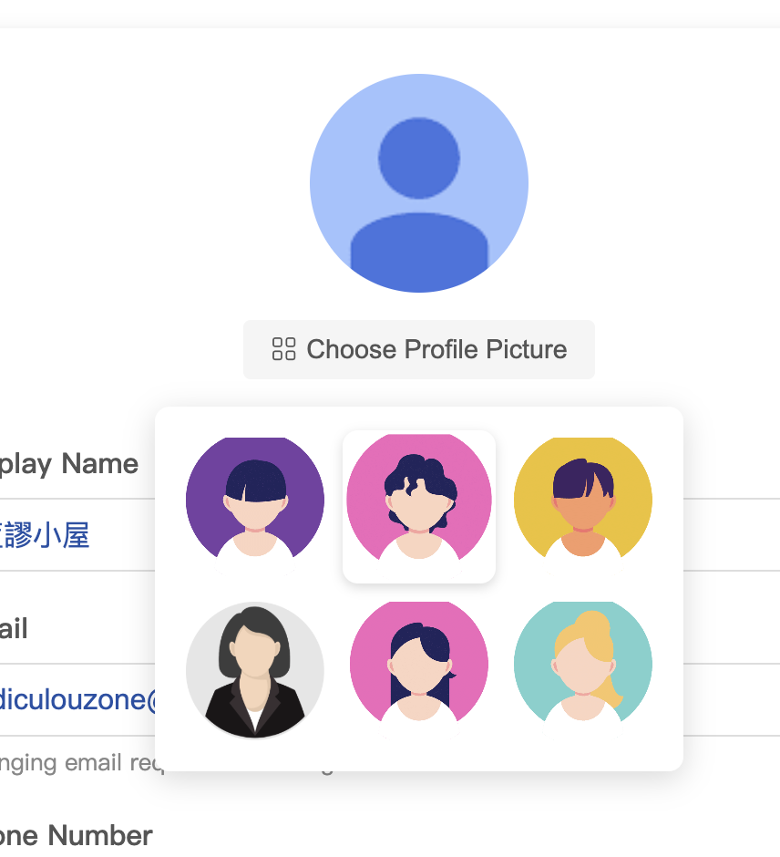
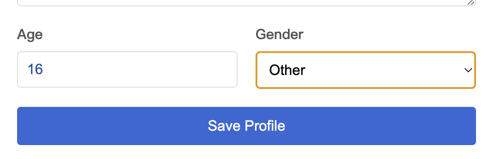
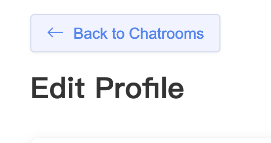


### Unsend Message

Right-click a message to open a context menu and remove it from the chat.

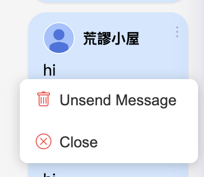

### Search Messages

Search by keyword inside the chatroom settings panel. Matching messages are highlighted, and clicking a result jumps to the message.

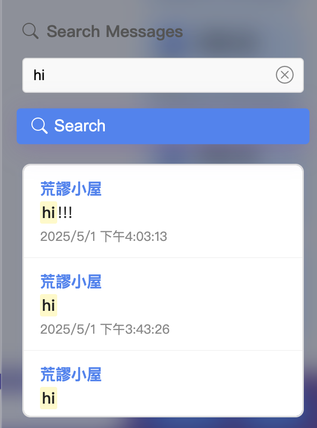
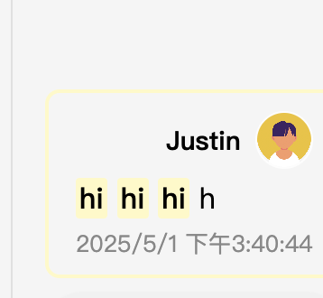

### Send GIFs

Use the GIF button to search for and send animated GIFs.

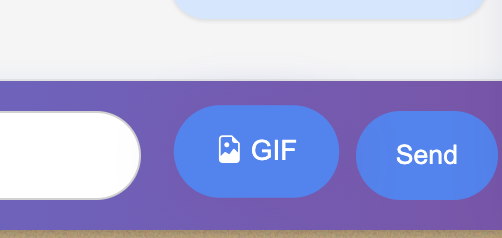
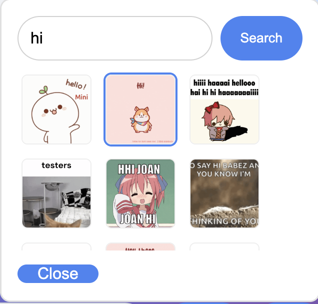

## Local Development

```bash
npm install
npm start
```

The app runs locally through the standard Create React App development server.

## Notes

If you change your avatar in the local version, the deployed web version avatar may disappear because local and hosted image paths are different.

Good next engineering improvements would be:

- add a `.env.example` for Firebase configuration;
- document the Firebase collection structure;
- add basic component tests for auth, room creation, and message search;
- separate demo assets from production user-uploaded assets.
