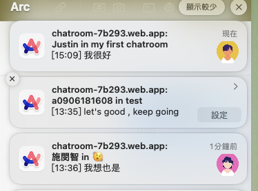

# Web Info
* **Web Link** : https://chatroom-7b293.web.app
* **Github Repo** : https://github.com/JustinShih0918/chatroom.git

## Basic Operation
* 一進入網站，會先看到顏色漸層背景與登入按鈕，選擇Sign In or Sign Up
* 點擊後會進入登入介面，透過滑鼠滑過背景，可以看到光點變大的效果
* 若不使用Google sign in，則選擇Sign Up，並輸入郵件與密碼，亦可以在Sign In頁面選擇Google Sign In
* 登入後，可以看見Loading動畫
* 進入聊天室後，找到左上角的「New Chatroom」，輸入聊天室名，創建一個新聊天室

* 成功創建後會出現在左邊的chatroom list的最下面
* 點擊進入聊天室，點選右上角設定icon，將你的好友加入聊天室中，輸入關鍵字（可查詢Justin就會有我的帳號可以加入，或註冊兩個帳號）直接點擊該好友即可完成，成功添加後可以在Member list裡看到聊天室成員。

* 之後就可以開始聊天了!輸入文字後透過Enter鍵或者send buttom來送出文字
* 接收到訊息後，若沒有在該聊天室中，則會收到通知，比如Justin傳
* 若想切換帳號，可到左下角點擊Sign out

我就會收到通知

## Bonus
* **Profile Page**
    * 點擊左下角的「Edit profile」 
    * 可以選擇不同的頭像
    * 更改完個人資料後需按下「Save Profile」
    * Save成功後點擊「Back to Chatroom」
    * 就可以發現頭像成功更改了
* **Unsend Message**
    * 右鍵你想要刪除的訊息，會出現功能選單
    * 選擇Unsend會直接刪除該訊息，若不想要刪除，需點擊「Close」按鍵
* **Search Message**
    * 在聊天室右上方找到設定icon，並點擊開啟設定介面
    * 在Search Message中輸入關鍵字，點擊搜尋
    * 可點擊搜尋到的該訊息，跳轉到該訊息
    * 搜尋到的關鍵字皆會被hightlight，直到重新進到設定中並將搜尋框中文字清空
* **Send Gifs**
    * 找到右下角的Gif buttom
    * 點擊後輸入關鍵字，並需點擊「Search」
    * 選擇你想傳送的Gif，若沒有想傳送的，需點擊「close」來關閉搜尋視窗

## how to setup my project locally
* unzip Midterm_Project_112062109.zip 
* cd ../Midterm_Project_112062109
* npm install
* npm start

